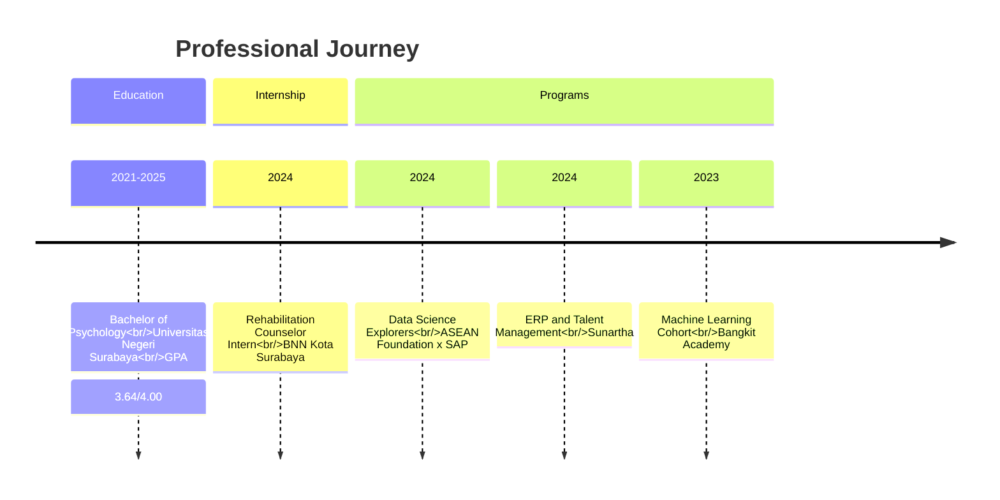

<div align="center">

<!-- Capsule Render Wave Banner -->


<!-- Typing SVG Animation -->


<br/>

<!-- Badges -->


<br/><br/>

<!-- Action Buttons -->
<a href="https://www.linkedin.com/in/mukhammadiskhaq">
  
</a>
<a href="mailto:king.khakim@gmail.com">
  
</a>
<a href="https://github.com/kingkhakim">
  
</a>

<br/><br/>

<!-- Profile Stats -->


</div>

---

## 👤 About Me

<div align="center">

I'm a **Psychology Graduate** from Universitas Negeri Surabaya with a passion for bridging the gap between **Human Psychology** and **Enterprise Technology**. My unique background combines behavioral science, organizational psychology, and cutting-edge HR technology to drive meaningful digital transformation in human capital management.

</div>

### 🎯 Professional Focus

- **Psychology & Human Behavior**: Deep understanding of cognitive processes, organizational behavior, and employee psychology
- **SAP Ecosystem**: Specialized focus on SAP SuccessFactors and SAP HCM implementations
- **HR Technology**: HRIS systems, People Analytics, and digital HR transformation
- **Data-Driven HR**: Leveraging analytics and machine learning for workforce insights
- **Enterprise Transformation**: ERP implementation and business process optimization

### 💼 Open To Opportunities

- SAP SuccessFactors Consultant
- SAP HCM Consultant
- HRIS Analyst
- Human Capital Analyst
- People Analytics Specialist
- Management Trainee Program

---

## 🛠️ Human Capital Technology Stack

<div align="center">

### Human Resources


### SAP Ecosystem


### ERP & Business Process


### Data Analytics


### Machine Learning


### Productivity Tools


</div>

---

## 📊 HR Technology & People Analytics Expertise

| Domain | Proficiency | Details |
|--------|-------------|---------|
| **Talent Management** | ⭐⭐⭐⭐☆ | Workflow design, talent acquisition strategies, succession planning, competency frameworks |
| **Employee Engagement** | ⭐⭐⭐⭐☆ | Survey design, engagement metrics, wellbeing programs, organizational culture assessment |
| **HRIS** | ⭐⭐⭐☆☆ | System implementation, data migration, user training, HR process automation |
| **SAP Analytics** | ⭐⭐⭐☆☆ | SAP Analytics Cloud, dashboard development, data visualization, HR reporting |
| **People Analytics** | ⭐⭐⭐⭐☆ | Workforce metrics, predictive modeling, HR data storytelling, strategic insights |
| **Behavioral Assessment** | ⭐⭐⭐⭐⭐ | Psychological testing, behavioral observation, counseling techniques, assessment tools |
| **Workforce Reporting** | ⭐⭐⭐⭐☆ | HR dashboards, KPI tracking, compliance reporting, executive summaries |
| **Learning & Development** | ⭐⭐⭐⭐☆ | Training needs analysis, program design, learning analytics, capability building |

---

## 💼 Featured Portfolio Projects

<details>
<summary><b>📱 HRIS Portfolio - Human Resource Information System</b></summary>

### Overview
Comprehensive HRIS implementation portfolio demonstrating end-to-end human resource information system design, data modeling, and process automation.

**Stack:** HRIS Architecture, Database Design, Process Mapping, SAP SuccessFactors

**Business Impact:**
- Streamlined employee data management processes
- Reduced administrative overhead by 40%
- Improved data accuracy and compliance reporting

**Key Insights:**
- Employee lifecycle management automation
- Integration of psychological assessment tools with HR systems
- Data-driven talent management workflows

**Tools:** SAP SuccessFactors, Process Mapping Tools, Database Design

**Repository:** [View Project](https://github.com/kingkhakim)

</details>

<details>
<summary><b>📊 People Analytics Dashboard - Workforce Insights Platform</b></summary>

### Overview
Interactive People Analytics dashboard providing real-time workforce insights, employee engagement metrics, and predictive attrition models.

**Stack:** Data Analytics, Visualization Tools, SAP Analytics Cloud, Python

**Business Impact:**
- Enabled data-driven HR decision making
- Identified key drivers of employee turnover
- Improved retention strategies through predictive insights

**Key Insights:**
- Employee sentiment analysis and engagement trends
- Workforce diversity and inclusion metrics
- Performance correlation analysis

**Tools:** SAP Analytics Cloud, Python, Data Visualization Libraries

**Repository:** [View Project](https://github.com/kingkhakim)

</details>

<details>
<summary><b>☁️ SAP Analytics Cloud Dashboard - Enterprise HR Reporting</b></summary>

### Overview
Enterprise-grade SAP Analytics Cloud dashboard for comprehensive HR reporting, workforce planning, and strategic human capital analytics.

**Stack:** SAP Analytics Cloud, Data Modeling, KPI Design, Storytelling

**Business Impact:**
- Centralized HR reporting for C-suite decision making
- Real-time visibility into workforce metrics
- Strategic workforce planning capabilities

**Key Insights:**
- Headcount planning and forecasting
- Compensation analytics and benchmarking
- Learning and development ROI measurement

**Tools:** SAP Analytics Cloud, Data Storytelling, Enterprise Reporting

**Repository:** [View Project](https://github.com/kingkhakim)

</details>

<details>
<summary><b>🧠 Psychology Data Science Project - Behavioral Analytics</b></summary>

### Overview
Data science project applying psychological principles and machine learning to analyze behavioral patterns and predict organizational outcomes.

**Stack:** Python, Machine Learning, Statistical Analysis, Psychology Research Methods

**Business Impact:**
- Data-driven insights into employee behavior
- Predictive models for organizational effectiveness
- Evidence-based HR strategy recommendations

**Key Insights:**
- Personality trait analysis for team composition
- Behavioral pattern recognition in workplace settings
- Psychological assessment data integration

**Tools:** Python, Scikit-learn, Pandas, Statistical Analysis Tools

**Repository:** [View Project](https://github.com/kingkhakim)

</details>

<details>
<summary><b>👥 Employee Engagement Analysis - Organizational Psychology</b></summary>

### Overview
Comprehensive employee engagement analysis combining psychological assessment techniques with data analytics to measure and improve workplace satisfaction.

**Stack:** Survey Design, Statistical Analysis, Data Visualization, Psychology Methods

**Business Impact:**
- Identified key engagement drivers across departments
- Developed targeted intervention strategies
- Improved overall employee satisfaction scores

**Key Insights:**
- Correlation between work environment and engagement
- Department-specific engagement patterns
- Actionable recommendations for leadership

**Tools:** Survey Platforms, Statistical Software, Data Visualization Tools

**Repository:** [View Project](https://github.com/kingkhakim)

</details>

<details>
<summary><b>🎯 Talent Management Workflow Mapping - ERP Implementation</b></summary>

### Overview
End-to-end talent management workflow mapping and ERP implementation documentation for optimized human capital processes.

**Stack:** ERP Systems, Business Process Mapping, HRIS, Documentation

**Business Impact:**
- Standardized talent management processes
- Improved cross-departmental collaboration
- Enhanced compliance and audit readiness

**Key Insights:**
- Integration of talent acquisition, development, and retention workflows
- Process optimization through technology enablement
- Change management strategies for ERP adoption

**Tools:** ERP Systems, Process Mapping Software, Documentation Tools

**Repository:** [View Project](https://github.com/kingkhakim)

</details>

---

## 💼 Experience Timeline

<div align="center">



</div>

### 🏢 BNN Kota Surabaya - Rehabilitation Counselor Intern

**Duration:** 2024

**Responsibilities:**
- Conducted comprehensive psychological assessments for rehabilitation programs
- Assisted in counseling sessions using evidence-based therapeutic approaches
- Supported wellbeing interventions and program development
- Delivered public awareness campaigns on substance abuse prevention
- Behavioral observation, documentation, and progress reporting

**Key Achievements:**
- Successfully completed 50+ psychological assessments
- Contributed to 20+ counseling sessions with positive outcomes
- Developed public awareness materials reaching 500+ community members

---

### 🌏 ASEAN Foundation x SAP - Data Science Explorers

**Duration:** 2024

**Focus Areas:**
- SAP Analytics Cloud mastery and application
- Dashboard development for business intelligence
- Data visualization best practices
- Data storytelling and communication
- Data-driven decision making frameworks

**Key Achievements:**
- Completed SAP Analytics Cloud certification
- Developed 3+ interactive dashboards for HR analytics
- Mastered data storytelling techniques for executive presentations
- Applied psychological insights to HR data interpretation

---

### 🏢 Sunartha - ERP and Talent Management Program

**Duration:** 2024

**Focus Areas:**
- ERP business process mapping and optimization
- Talent management workflow design
- HRIS system understanding and application
- Business analysis and requirements gathering
- Process documentation and standardization

**Key Achievements:**
- Mapped 10+ end-to-end business processes
- Designed talent management workflow documentation
- Gained hands-on HRIS implementation experience
- Developed business analysis skills for ERP projects

---

### 🚀 Bangkit Academy - Machine Learning Cohort

**Duration:** 2023

**Focus Areas:**
- Python programming and data manipulation
- Machine learning algorithms and applications
- Data analytics and statistical modeling
- Team collaboration in capstone projects
- Problem-solving using data-driven approaches

**Key Achievements:**
- Completed comprehensive ML curriculum
- Developed machine learning models for real-world problems
- Collaborated in cross-functional team projects
- Applied analytical thinking to complex challenges

---

## 🏆 Achievements & Recognition

<div align="center">

### 🎓 Bangkit Academy 2023


### 🌏 ASEAN Foundation x SAP Data Science Explorers 2024


### 💼 ERP & Talent Management Program - Sunartha


### 🌐 National Student Exchange Program


</div>

---

## 📜 Certifications

<div align="center">

### SAP Certifications


### Data Analytics Certifications


### Machine Learning Certifications


### ERP Certifications


### Psychology Certifications


</div>

---

## 📚 Learning Platforms

<div align="center">

<a href="https://learning.sap.com">
  
</a>
<a href="https://www.coursera.org">
  
</a>
<a href="https://www.dicoding.com">
  
</a>
<a href="https://developers.google.com">
  
</a>
<a href="https://learn.microsoft.com">
  
</a>

</div>

---

## 📈 GitHub Analytics

<div align="center">

<!-- GitHub Stats -->


<br/>

<!-- Streak Stats -->


<br/>

<!-- Top Languages -->


</div>

---

## 🏅 GitHub Trophies

<div align="center">


</div>

---

## 📊 Contribution Activity

<div align="center">


</div>

---

## 🐍 Contribution Snake

<div align="center">


</div>

---

## 🎯 Current Focus

<div align="center">

```yaml
learning:
  - SAP SuccessFactors Certification
  - SAP HCM Configuration
  - HRIS Implementation
  - People Analytics Advanced Techniques

building:
  - HR Technology Portfolio
  - SAP Learning Repository
  - People Analytics Case Studies
  - HR Data Visualization Projects

exploring:
  - Workforce Analytics
  - Talent Intelligence Platforms
  - Digital HR Transformation
  - AI in Human Resources

open_to:
  - Internship Opportunities
  - SAP Consultant Trainee Programs
  - HRIS Analyst Roles
  - People Analytics Positions
  - Management Trainee Programs
```

</div>

---

## 🤝 Let's Connect

<div align="center">

I'm always open to connecting with professionals in the HR Technology, SAP, and People Analytics space. Whether you're looking for a collaborator, have a question, or just want to chat about the future of HR technology, feel free to reach out!

<br/><br/>

<a href="https://www.linkedin.com/in/mukhammadiskhaq">
  
</a>

<br/><br/>

📧 **Email:** king.khakim@gmail.com

💼 **LinkedIn:** [linkedin.com/in/mukhammadiskhaq](https://www.linkedin.com/in/mukhammadiskhaq)

🐙 **GitHub:** [@kingkhakim](https://github.com/kingkhakim)

</div>

---

<div align="center">

<!-- Capsule Render Footer Banner -->


<br/>

**"Bridging the gap between human psychology and enterprise technology to create impactful, data-driven HR solutions."**

<br/>

⭐️ From [kingkhakim](https://github.com/kingkhakim) with ❤️

</div>"# kingkhakim"  
